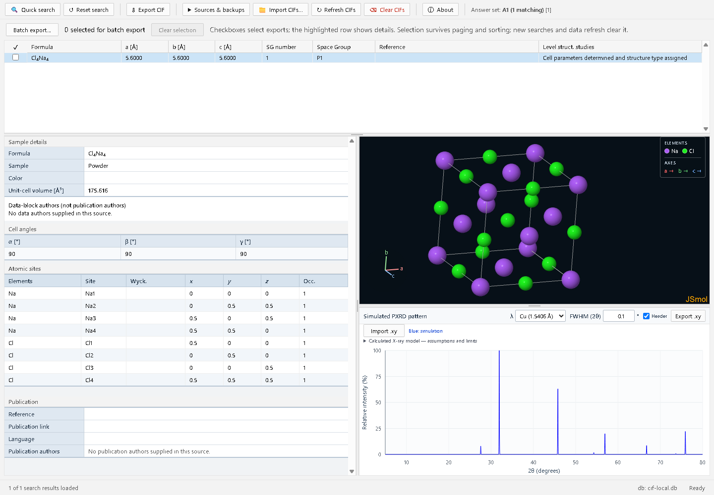
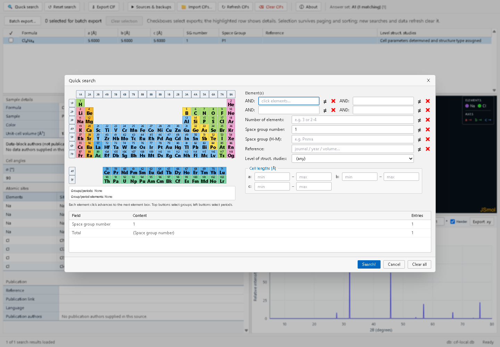
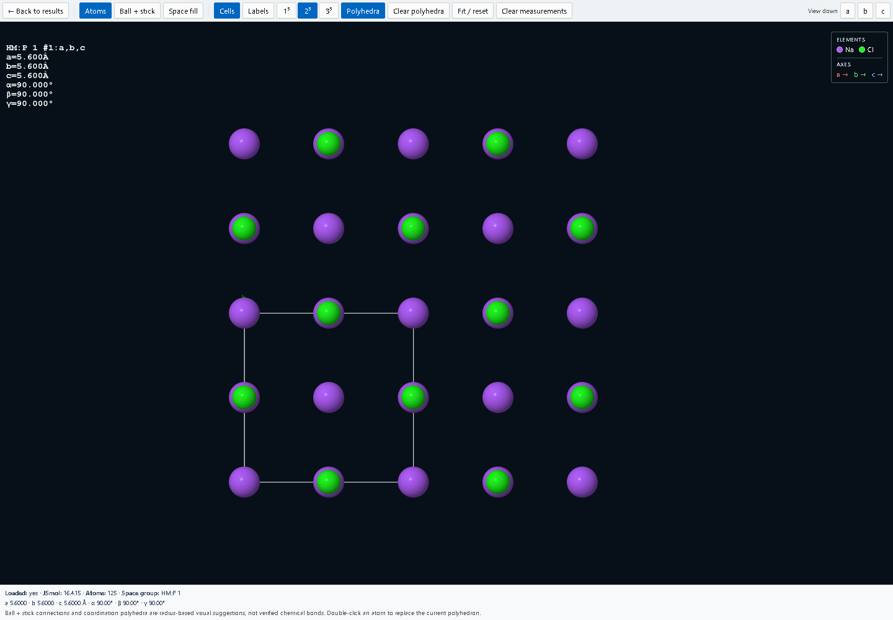
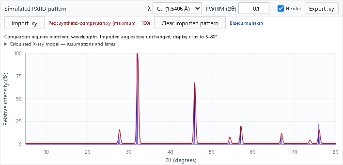
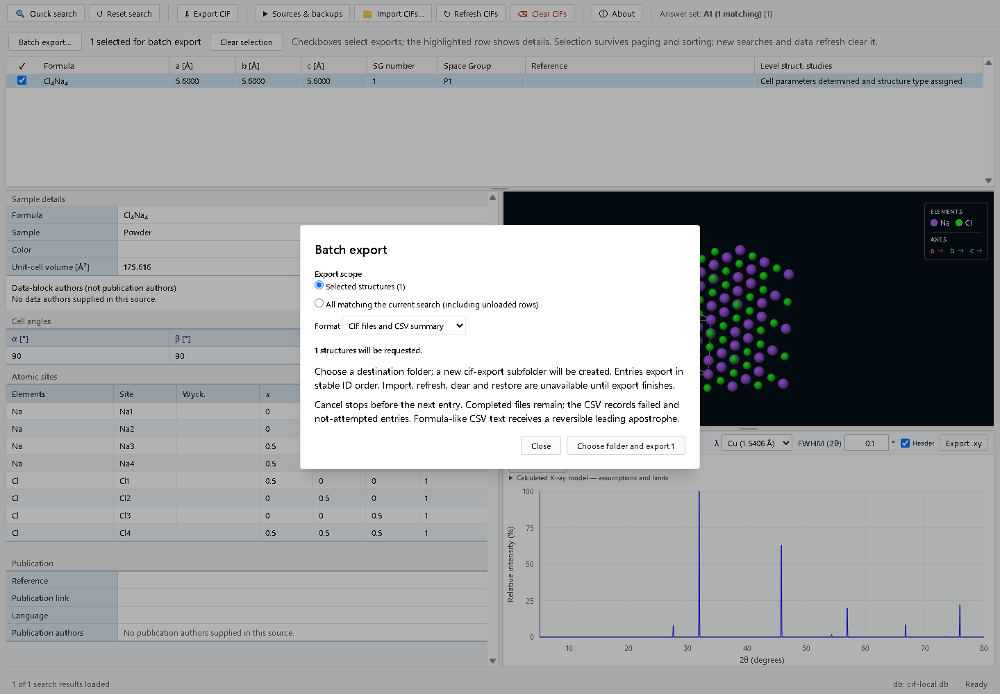

# CIF Crystal Data

A local desktop database for crystallographic data extracted from CIF files, built with
Electron, React, TypeScript, Tailwind CSS, and better-sqlite3.

See the [documentation index](docs/README.md) for current guidance, historical evidence
and proposals.

Released under the [MIT License](LICENSE).



The main workspace keeps search results, compound details, the crystal structure, and
simulated diffraction together. All screenshots use an [original synthetic sample](docs/samples/rocksalt-demo.cif)
in a clean test profile; the sample is an idealized demonstration, not experimental data.

## App screenshots



**Quick search:** combine element selections, space-group criteria, and cell-length ranges;
preview the number of matching structures before running the search.



**Crystal viewer:** double-click the embedded structure to open the full-window controls,
then choose a representation, unit-cell block size, or crystallographic viewing axis.
Distance, angle, and polyhedra controls are available in the same toolbar.



**Powder diffraction:** adjust wavelength and peak broadening, inspect reflections,
compare an imported `.xy` pattern, and export the simulation. The red trace uses an
[original synthetic illustration](docs/samples/synthetic-comparison.xy), not experimental
data or a fitted reference pattern.

Choose Cu (1.5406 Å), Mo (0.7107 Å), Co (1.7902 Å), or Ag (0.5609 Å).
Cu is the initial default; the selected preset stays in effect while browsing.
**Import .xy** adds a red personal pattern beside the blue simulation. Imported
angles stay unchanged when the simulation wavelength changes, so direct comparison
requires matching wavelengths. **Clear imported pattern** removes that overlay;
**Export .xy** still exports only the simulation.

Personal patterns accept two whitespace-separated numeric columns (2θ in degrees,
intensity), blank lines, `#` comments and an optional initial `2theta intensity`
header, including this application's exports. Angles must increase strictly within
0–180°, with at least two points and some positive intensity. Negative intensities
are rejected without baseline correction. Limits are 4 MiB and 100,000 points.
Original values are retained in memory; display intensities are scaled to a maximum
of 100 and clipped to 5–80°. The overlay survives structure changes for this session.
See [viewer and comparison validation](docs/viewer-comparison.md) for supported
formula notation, viewer controls, synthetic references and limitations.

See [screenshot capture instructions](docs/images/README.md) to regenerate these images.

## Dev mode

Development requires Node.js 22.13 or newer.

```
npm install
npm start
```

This starts the Electron app with a live-reloading renderer. `npm run dev` is an alias
for the same development command.

For repeatable startup measurements and comparisons with the recorded baseline, see
[the startup benchmark](docs/startup-baseline.md). Run `npm run benchmark:startup`
on an idle Windows desktop using Node 22.13+ on the Node 22 line.

## Navigating search results

In search results, focus the grid and press **Ctrl+Shift+Enter** to center the selected
row after scrolling away. The selection, horizontal scroll and detail/viewer/PXRD
panels stay unchanged. The shortcut only applies to the focused results grid; it
does not act in text fields or modal dialogs. Near either end, the row is shown as
close to the center as the available scroll range permits.

## Batch export



After a Quick search, check rows for batch selection or choose **All matching the
current search** in **Batch export…**. Review the exact count, then export CIFs,
CIFs with a CSV summary, or CSV alone into a new subfolder. Progress and cancellation
retain completed files and report failed and not-attempted entries. Checkbox
selection survives paging and sorting and clears on new searches or data refresh.
The highlighted detail row and single-entry **Export CIF** remain independent.
See [Batch export](docs/batch-export.md) for snapshot behavior, CSV fields, reversible
spreadsheet escaping, destination requirements and validation.

## Importing CIF files

Click **Import CIFs...** in the toolbar, then choose a folder in the native folder picker.
The app recursively scans the folder for `*.cif` files and keeps a managed copy of the
original bytes with the indexed metadata. Equal filenames in different folders remain
separate structures. Refresh hashes each file, skips unchanged sources, and reports new
structures, updates, identical copies kept separately, and failures. A failed block leaves
the entire previous version of that file intact.

The selected folder is remembered. Startup refresh defaults off; enable it under **Sources & backups**. **Refresh CIFs** scans it again.
A changed file updates structures with the same unique data-block labels. Renamed or copied
files remain separate unless you explicitly relink the existing source to an identical copy.

Use **Sources & backups** to save a portable backup, restore one, or relink the selected
source. Viewing and export use the managed imported version even after the original is
moved, edited, or deleted. Backup and export require a new destination filename.
See [Import and search reliability](docs/import-search-reliability.md) for cancellation, diagnostics, author roles, and startup behavior.
See [Data preservation](docs/data-preservation.md) for identity, migration, legacy-source,
relinking, backup, and recovery policies.

The import preserves the inputs used by the simulated powder-diffraction view: unit-cell
lengths in ångströms, formula units per cell, radiation type and wavelength, symmetry
operations, atom positions and occupancies, and available displacement parameters. The PXRD
panel supports a per-pattern wavelength, configurable peak broadening, reflection hover labels,
and two-column `.xy` export with an optional header. Files containing multiple `data_` blocks
are indexed as separate structures while retaining their shared physical source file.

PXRD uses neutral-atom IT92 X-ray form factors and runs in a cancellable local worker.
The assumptions panel reports defaults, unsupported inputs and incomplete reflection
searches. Header-enabled exports record the model and calculation settings; plain
two-column output remains available. See [Scientific validity](docs/scientific-validity.md)
for reference comparisons and limits, and [Recovery and responsiveness](docs/scientific-recovery.md)
for failure and packaged-workflow verification.

The parser is regression-tested against the current PCD, ICSD, and CCDC/CSD corpus. It
accepts CCDC moiety formulas when a sum formula is absent, resolves the corpus's symbol-only
space groups, and stores CCDC deposition numbers, CSD refcodes, ICSD identifiers, and DOI
metadata for source-aware publication links. DOI links are preferred; when a DOI is absent,
clicking the link performs a conservative, session-cached Crossref lookup. A DOI is used only
when returned metadata agrees across the available title and citation fields. Ambiguous matches
are never stored and retain the exact-title Scholar or Access Structures fallback.

## Building the packaged app

Reproducible coverage, complexity, and duplication reports are documented in
[Code-quality measurements](docs/code-quality.md). Run `npm run quality:baseline` to
collect an advisory baseline locally; the Code-quality baseline workflow publishes
the same reports in GitHub Actions.

The [test-gap review](docs/test-gap-review.md) documents current regression coverage
and remaining gaps. Run `npm run test:all` for unit/UI/worker checks and
`npm run test:viewer` for the separate self-contained JSmol suite; CI runs both.

```
npm test          # Vitest unit and regression tests
npm run typecheck # TypeScript, no emit
npm run build     # builds main/preload/renderer bundles
npm run package   # builds + runs electron-builder for Windows
```

`npm run package` produces a `release/win-unpacked` folder (runnable directly) plus an NSIS
installer and a portable executable, targeting Windows x64.

## Local crystal viewer

The compound details workspace includes a reusable JSmol 16.4.15 HTML5 viewer.
The pinned runtime is packaged under `dist/vendor/jsmol`; it does not use a CDN,
PHP relay, remote rendering service, tracking endpoint, or database-loading URL.
Fullscreen controls provide packed 1×1×1, 2×2×2, and 3×3×3 unit-cell blocks. Enable
**Polyhedra**, then click an atom to display its radius-based coordination polyhedron.

The Electron security boundary remains unchanged: context isolation is enabled
and Node integration is disabled. The preload bridge exposes only
`getViewerSource(entryId)`, which validates the database entry in the main
process and returns the original CIF text plus its filename. Renderer and JSmol
code receive neither source paths nor general filesystem access. JSmol requires
`unsafe-eval` in the renderer CSP for its Java-to-JavaScript class runtime; the
policy continues to disallow remote scripts, inline scripts, and object content.
The generated one-line applet bootstrap handler is removed and invoked from the
trusted runtime adapter so `script-src 'unsafe-inline'` is not required.

Third-party licence text and notices are packaged from `third_party/`.

### Native module (better-sqlite3)

The pinned better-sqlite3 13 release uses Node-API and ships prebuilt native binaries,
including Windows x64. These binaries work in both Node.js and Electron without an
Electron-specific rebuild. Installation intentionally has no native rebuild hook, and
packaging keeps `npmRebuild: false`.

If an older checkout fails during `electron-builder install-app-deps` with a missing
Visual Studio error, update to this package configuration and rerun `npm install`.
The supported Windows x64 setup does not require Visual Studio or moving the project
to a path without spaces.

## Publishing a GitHub release

The `Release Windows application` GitHub Actions workflow publishes the NSIS installer,
portable executable, `SHA256SUMS.txt`, and a CycloneDX SBOM. It runs the complete test suite
before packaging, creates a signed GitHub artifact attestation when the repository is public,
and retains the same files as a workflow artifact for 14 days. GitHub does not offer artifact
attestations for user-owned private repositories.

To publish a release:

1. Update `version` in `package.json` and `package-lock.json`, then commit the change.
2. Create a matching semantic-version tag, such as `v1.1.0`:

   ```powershell
   git tag v1.1.0
   git push origin main v1.1.0
   ```

3. The tag push starts the release workflow. GitHub generates the release notes and attaches
   both Windows executables and their checksums.

The workflow can also be run manually from the Actions tab for an existing tag. Manual runs
do not create tags, and the workflow fails if the tag version differs from `package.json`.
Tags containing a prerelease suffix, such as `v1.2.0-beta.1`, create GitHub prereleases.

The generated Windows executables are unsigned unless the protected
`WINDOWS_CERTIFICATE` and `WINDOWS_CERTIFICATE_PASSWORD` repository secrets are configured.
The workflow verifies every configured signature and fails instead of publishing an invalid
one. Unsigned builds may trigger a Windows SmartScreen warning.

## Workspace preferences and keyboard controls

Panel sizes and results-table column widths are saved locally and restored on reopening.
Panel sizes are constrained to fit the available window. Focus a divider with Tab and use
its arrow keys to resize; Enter or double-click restores its default split. Focus the
results table and use Up/Down to select rows; Home/End navigate the currently loaded rows.
The About dialog supports Escape, contained Tab navigation, and return of focus to its opener.

## Packaged workflow verification

After packaging, run the isolated real-data smoke test with explicit paths:

```powershell
node scripts/packaged-smoke.mjs "release/win-unpacked/CIF Crystal Data.exe" "path/to/CIF-folder"
```

The test uses a temporary database/profile, reads the supplied CIFs, searches and exports,
checks detail/PXRD rendering, and restarts the packaged executable to check database persistence.
Its report and any available screenshot are saved in the printed temporary profile directory.
It does not install the NSIS package or modify the normal application database.
